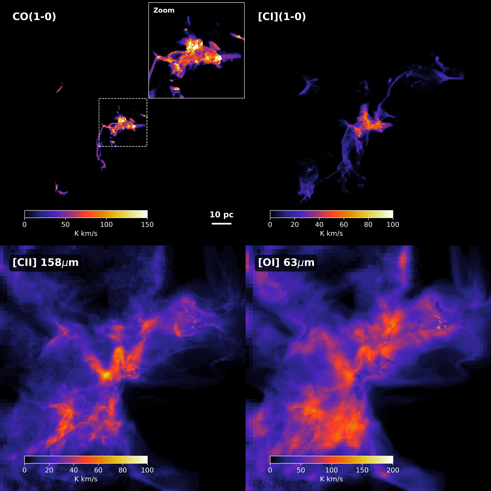

.. _RTgallery:

Gallery
=======

Velocity integrated emission maps of a star-forming region using **RT-synth**. The snapshot is taken from the SILCC-Zoom project (`Seifried et al., 2017 <https://ui.adsabs.harvard.edu/abs/2017MNRAS.472.4797S/abstract>`_) and it is modelled at a resolution of :math:`512^{3}` using the MPI version of 3D-PDR. This is the highest resolution 3D model of PDRs in the field.

Top left shows the emission of CO(1-0) and the inset shows a detail of the central region. Top right shows the [CI] (1-0) line. Bottom left shows the [CII] line at 158μm and bottom right the [OI] line at 63μm.

