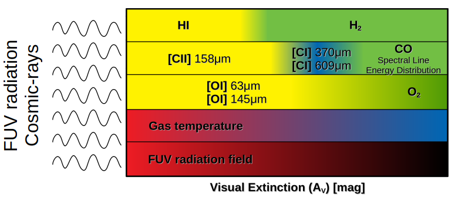

Background
==========

Photodissociation regions (PDRs, see `Hollenbach & Tielens 1999 <https://ui.adsabs.harvard.edu/abs/1999RvMP...71..173H/abstract>`_; `Tielens 2005 <https://ui.adsabs.harvard.edu/abs/2005pcim.book.....T/abstract>`_; `Wolfire et al. 2022 <https://ui.adsabs.harvard.edu/abs/2022ARA%26A..60..247W/abstract>`_) are areas in the interstellar medium where far-ultraviolet (FUV) photons with energies between 6 and 13.6 eV dominate the chemistry and thermal balance of the gas. These regions form at the interface between ionized and molecular gas, where FUV radiation from nearby stars penetrates the surrounding medium, leading to photoelectric heating, molecular dissociation, and ionization of atoms. 

The resulting stratified structure comprises atomic, ionized, and molecular layers. This makes PDRs key environments for understanding star formation, molecular cloud evolution, and interstellar line emission. They are found in a wide range of astrophysical contexts, from protoplanetary disks and star-forming regions to the interstellar medium of entire galaxies.

Studies of PDRs allow us to understand the effects of FUV photons on the chemistry and structure of the neutral ISM in galaxies, as well as diagnosing the conditions within star-forming regions. PDRs are responsible for most of the infrared radiation from galaxies. Solving numerically the astrochemical network that occurs in PDRs is a powerful way to estimate the abundances of species and simulate the line emission of the observed galactic and extragalactic clouds.

