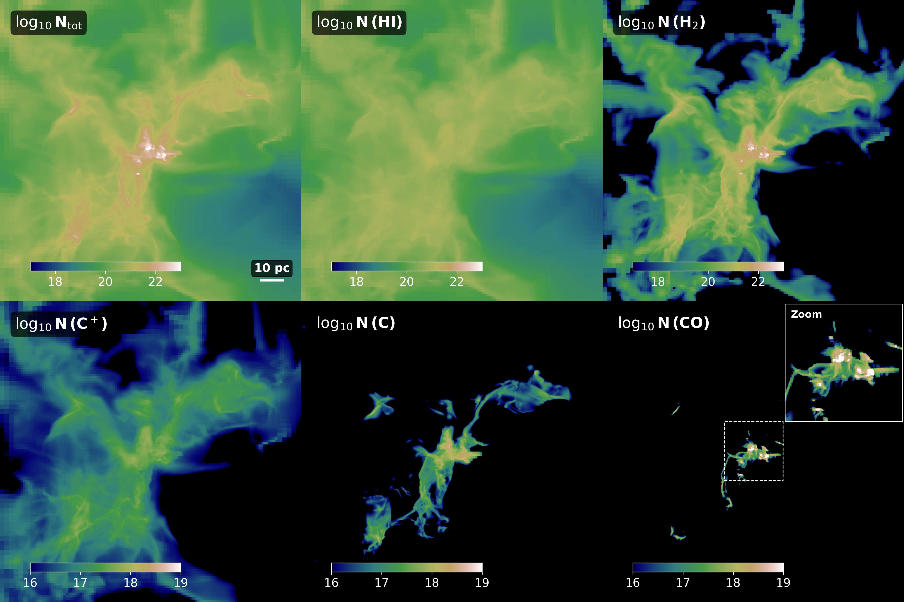

Gallery
=======

Column density maps of a star-forming region. The snapshot is taken from the SILCC-Zoom project (`Seifried et al., 2017 <https://ui.adsabs.harvard.edu/abs/2017MNRAS.472.4797S/abstract>`_) and it is modelled at a resolution of :math: `512^3` using the MPI version of 3D-PDR. This is the highest resolution 3D model of PDRs in the field. 

Top left shows the column density of the total H-nucleus number density. The HI and H2 column densities are shown in the second and third paneil of the top row. Bottom row shows the column densities of the carbon cycle (C+, C, CO from left-to-right). The inset in the bottom right panel shows a close-up of the star-forming region. 

