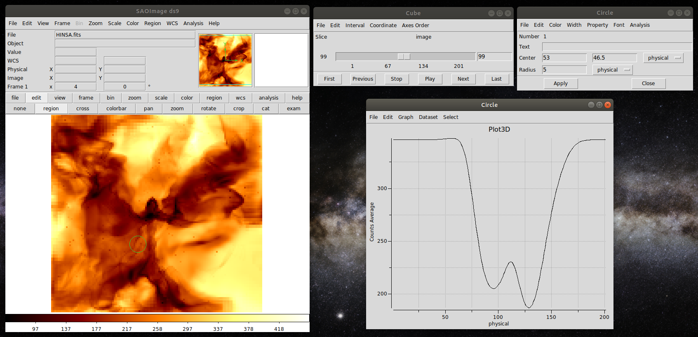

The RT-synth Algorithm
======================

**RT-synth** constructs synthetic observations for three-dimensional **3D-PDR** outputs. The algorithm runs only from terminal.

Compilation Parameters
~~~~~~~~~~~~~~~~~~~~~~

Edit the ``makefile`` in ``RT-synth/``:

First section (compilers):
--------------------------

* ``FC``: Fortran compiler (e.g., ``gfortran``)
* ``HDF5_DIR``: Specify the hdf5 installation directory
* ``HDF5_INCLUDE``: Do not change this unless you manually specify the /include directory
* ``HDF5_LIB``: Do not change this unless you manually specify the /lib directory
* ``LIBS``: Default flags
* ``FFLAGS``: Debugging flags
* ``HDF5_CFLAGS``: Optional CFLAGS
* ``HDF5_LDLIBS``: Optional LDLIBS

Second section (RT parameters):
+++++++++++++++++++++++++++++++

* ``HDF5``: Flag to handle HDF5 files (1) or ascii files (0)
* ``VELOCITY``: Set to 1 if velocity file exists (creates velocity-integrated maps)
* ``OPENMP``: Run in OpenMP parallelization (1) or in serial (0)
* ``DUST``: Include dust contribution (1) or not (0)
* ``BACKGROUND``: Remove background (1) or not (0)
* ``CRATTENUATION``: Flag to produce a density-weighted CR map (1) or not (0), provided you have performed the appropriate 3D-PDR simulation
* ``HI21CM``: Calculate the HI 21cm emission (1) or not (0)
* ``MULTILINES``: Compute all default lines (1) or single line (0)
* ``MULTIDIRECTION``: Compute all viewing angles (1) or single direction (0)
* ``CDONLY``: Calculate the column densities only and terminate RT-synth (1) or proceed with RT calculation (0)

The paramsRTsynth.dat File
~~~~~~~~~~~~~~~~~~~~~~~~~~

::

   1) sims            !Directory of PDR output
   2) yourmodelpref   !Model prefix
   3) gasvelocity     !velocity file
   4) 1               !Vturb (km/s)
   5) 1               !dust-to-gas norm. to 1e-2
   6) 0               !Redshift (for Tcmb)

* **Entries 1-6**: General parameters (directory, prefix, velocity file, turbulent velocity, dust-to-gas ratio, redshift)

::

   7)  +z              !direction of integration
   8)  64              !ctot
   9)  1               !coolant
   10) 1               !line
   11) 0               !ignore edge cells
   12) -20             !velmin (km/s)
   13) 20              !velmax (km/s)
   14) 5               !velstep

* **Entries 7-14**: Observation-specific parameters (direction, resolution, coolant, line, edge cells, velocity range)

Running RT-synth
~~~~~~~~~~~~~~~~

.. code-block:: bash

   cd RT-synth
   make clean; make
   cd ..
   ./RTsynth

Outputs
~~~~~~~

* ``RT_[prefix]_[los_direction]_cds.dat``: Column densities (H₂, HI, C⁺, C, CO, HCO⁺, total)
* ``RT_[prefix]_[los_direction]_[line].dat``: Velocity-integrated maps
* ``RT_vel_[prefix]_[los_direction]_[line].dat``: Radiation temperature per velocity channel

The vel2fits.py File
~~~~~~~~~~~~~~~~~~~~

Convert PPV output to FITS format. Edit the first lines:

.. code-block:: python

   data = np.loadtxt('RT_vel_SILCC64_+z_CO10.dat')  # Input file
   ipix = 64                                        # Resolution
   csize = 62.5                                     # Cloud size (pc)
   outputname = 'SILCC64_vel_CO10.fits'            # Output name
   channels = 201                                   # Number of channels

Run with:

.. code-block:: bash

   python vel2fits.py

Example
~~~~~~~

The figure below shows an example FITS file generated with ``vel2fits.py`` and viewed with ``ds9``.

See :ref:`RTgallery` for velocity integrated emission maps produced with **RT-synth**
